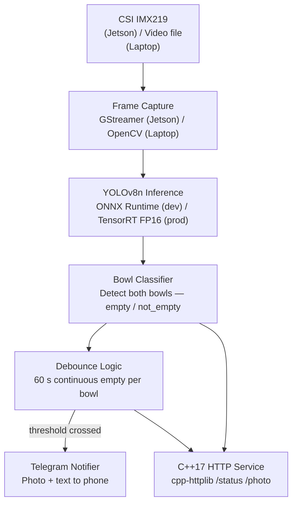

# CatBowlWatch

**Edge ML pipeline — Jetson Nano 4GB + CSI camera → YOLOv8n → C++17 service → Telegram alert.**

Two cat food bowls. One camera. Fully automatic detection, no manual ROI. When either bowl has been empty for ≥ 60 consecutive seconds the system sends a Telegram photo + text notification to your phone.

Built as a portfolio piece demonstrating end-to-end ML-to-C++ edge deployment: data collection, training, ONNX inference, debounce logic, real-time notification, and hardware deployment on Jetson Nano — all from scratch.

> **Status (2026-05-19):** Phases 1a, 2, and the Phase 3 toolchain scaffold are done. Phase 1b (iPhone footage + Roboflow labelling → ≥ 200 images) is the active data-collection work. Phase 3 real C++ components are being implemented — the toolchain has been validated on **macOS Apple Silicon** and WSL2 Ubuntu (OpenCV 4.13 + spdlog 1.14.1 + ONNX Runtime 1.20.1, `ctest` passing).

---

## Demo (Phase 4 preview — not yet runnable)

```bash
# Requires Docker and a valid .env with TELEGRAM_BOT_TOKEN + TELEGRAM_CHAT_ID
git clone https://github.com/YOUR_HANDLE/catbowlwatch
cd catbowlwatch
cp demo/.env.example .env     # fill in your Telegram credentials
docker compose -f docker/demo.yml up
```

The demo loops `data/videos/sample_video.mp4` (empty bowl visible from frame 1), runs inference with `DEBOUNCE_SECONDS=8`, and fires a real Telegram photo notification. **Notification arrives ~15 seconds after the service starts.** No Jetson needed.

> Production deployments use the 60 s debounce default. The demo override is explicit — see `demo/.env.example`.

---

## Architecture Overview



---

## Tech Stack

| Layer | Laptop (Dev) | Jetson (Prod) |
|---|---|---|
| Capture | OpenCV `VideoCapture` | GStreamer + `nvarguscamerasrc` |
| Model | YOLOv8n `.onnx` | YOLOv8n `.engine` (TensorRT FP16) |
| Runtime | ONNX Runtime CPU | TensorRT 8.x |
| Service | C++17 + cpp-httplib | Same binary, systemd unit |
| Notification | Telegram Bot API | Same |
| Low-light | Brightness sim (software) | IR floodlight + GPIO trigger |
| OS | macOS / Ubuntu 22.04 | JetPack TBD (B01 → 4.6.4; Orin Nano → 6.x) |
| Python deps | Poetry (`pyproject.toml`); base + optional `training` group | Same |
| Build | `make` (Phase 1 dataset pipeline) | + CMake for C++ service |

---

## Project Structure

Legend: ✓ = in repo today, ⏳ = scaffolded (empty), ☐ = planned, not yet created.

```
catbowlwatch/
├── pyproject.toml ✓        # Poetry env: base deps + optional `training` group
├── poetry.lock ✓
├── Makefile ✓              # make data | collect | validate | split | test | clean-data
├── data/
│   ├── raw/                ⏳ gitignored — iPhone drops + Roboflow exports
│   ├── images/{train,val,test}/  ⏳ gitignored — produced by `make split`
│   ├── labels/{train,val,test}/  ⏳ gitignored — produced by `make split`
│   ├── videos/             ⏳ sample_video.mp4 to be committed
│   └── data.yaml           ⏳ produced by `make split`
├── scripts/
│   ├── collect_data.py ✓       # frame sampler (video or webcam)
│   ├── organise_raw.py ✓       # separate flat image/label exports by stem
│   ├── validate_labels.py ✓    # YOLO label sanity check
│   ├── split_dataset.py ✓      # seeded 70/15/15 split + data.yaml writer
│   ├── setup_wsl_dev.sh ✓      # WSL2 Ubuntu C++ toolchain bootstrap
│   └── setup_macos_dev.sh ✓    # macOS (Apple Silicon / Intel) C++ toolchain bootstrap
├── training/
│   ├── dataset.py ✓        # PyTorch BowlDataset
│   ├── augmentations.py ✓  # low-light adaptive preprocessing (CLAHE, matches C++ Preprocessor)
│   ├── train.py ✓          # Ultralytics YOLOv8n training entry; copies best.pt → models/
│   └── export.py ✓         # .pt → ONNX opset 17 with shape verification [1,6,8400]
├── inference/              ⏳ Phase 3 — C++17 ONNX/TensorRT service (scaffold ✓, components in progress)
│   ├── CMakeLists.txt ✓    # FetchContent spdlog/cpp-httplib/gtest; OpenCV + ONNX Runtime
│   ├── src/main.cpp ✓      # smoke binary (toolchain validator — will become real entrypoint)
│   └── tests/test_smoke.cpp ✓  # GoogleTest Smoke.ToolchainOk
├── notification/           ☐ Phase 4 — Telegram notifier
├── deployment/             ☐ Phase 5 — GStreamer config, systemd, GPIO
├── demo/
│   └── .env.example ✓      # Telegram + inference env vars
├── docker/                 ☐ Phase 4 — training + demo Dockerfiles
├── models/                 ⏳ .pt/.onnx/.engine artifacts (gitignored)
├── tests/ ✓                # 21 unit tests; Phase 2 parity tests planned
├── docs/
│   ├── DESIGN_REQUIREMENTS.md ✓
│   └── ARCHITECTURE.md ✓
├── .github/workflows/      ☐ Phase 2+ — CI (lint, tests, ONNX validation)
├── README.md ✓
├── CLAUDE.md ✓             # dev context (architecture, commands, constraints)
└── LICENSE
```

---

## Development Phases

| # | Phase | Runs on | Status |
|---|---|---|---|
| 0 | Documentation | — | ✓ Done |
| 1a | Phase 1 plumbing (scripts, Makefile, Poetry env, tests) | Laptop | ✓ Done |
| 1b | Phase 1 data capture & labelling (≥ 200 images + sample video) | Laptop | **In Progress** |
| 2 | Training Pipeline (`augmentations.py`, `train.py`, `export.py`) | Laptop / Colab | ✓ Done (gated on 1b data for E2E run) |
| 3 | Inference Service (C++17, ONNX) — toolchain scaffold | Laptop (macOS + WSL2) | ✓ Scaffold done — components in progress |
| 4 | Notification & Demo (Docker) | Laptop | Planned |
| 5 | Hardware Deployment & TensorRT Swap | Jetson Nano | Pending hardware |

Phase boundaries and exit criteria: [docs/DESIGN_REQUIREMENTS.md §9](docs/DESIGN_REQUIREMENTS.md).

---

## Dataset Pipeline (Phase 1)

```bash
# Drop iPhone videos in data/raw/incoming/, then:
make collect           # sample frames from videos (1 fps default)
# Label the resulting frames in Roboflow (classes: bowl_empty, bowl_not_empty;
# export YOLOv8 format, NO split). Unpack the zip into data/raw/labelled/.
make data              # organise → validate → split 70/15/15 + write data/data.yaml
make test              # pytest
```

Override the split ratios or seed: `make split SPLIT_RATIOS="0.8 0.1 0.1" SEED=7`. Raw drops and split outputs are gitignored; `data/data.yaml` and `data/videos/sample_video.mp4` are committed once they exist.

---

## What's Next

**Phase 1b (now):** capture iPhone footage of the actual bowl setup → label in Roboflow → unzip into `data/raw/labelled/` → `make data`. Target ≥ 200 labelled images across both bowl states, varied lighting, with cat present/absent. Pick the best 20–30 s clip with an empty bowl from frame 1 and commit it to `data/videos/sample_video.mp4`. See the [iPhone labelling workflow notes](docs/DESIGN_REQUIREMENTS.md) and [labelling rules for two bowls](CLAUDE.md#dataset-pipeline-phase-1).

**Phase 3 (now — C++ inference service components):** Capture → Preprocessor → OnnxBackend → Postprocessor → BowlTracker → DebounceEngine → HttpServer. All contracts are defined in [docs/ARCHITECTURE.md](docs/ARCHITECTURE.md). The toolchain (OpenCV 4.13, ONNX Runtime 1.20.1, spdlog 1.14.1, GoogleTest) is validated on macOS Apple Silicon and WSL2 Ubuntu.

**Phase 2 E2E run (after Phase 1b exits):**

- `poetry install --with training` to bring in `torch`, `torchvision`, `ultralytics`
- `make train` then `make export-onnx` — produces `models/catbowlwatch.onnx`; target `mAP50 ≥ 0.80`
- Phase 3 OnnxBackend picks up the model via `MODEL_PATH` env var

---

## Prerequisites

- **Python ≥ 3.10** + **[Poetry](https://python-poetry.org/) ≥ 1.8** — everything Python runs inside the Poetry env (`poetry install` for Phase 1; `poetry install --with training` adds PyTorch + Ultralytics for Phase 2)
- **GNU make** — for the `make data` pipeline (on Windows use WSL, Git Bash with make, or `winget install GnuWin32.Make`; or invoke the scripts directly via `poetry run python scripts/<…>.py`)
- **CMake ≥ 3.22, GCC ≥ 11 (C++17)** — Phase 3 onward
- **ONNX Runtime ≥ 1.17** (CPU build for laptop) — Phase 3 onward
- **Docker ≥ 24** — Phase 4 demo and training containers
- A Telegram bot token — see [docs/DESIGN_REQUIREMENTS.md §6](docs/DESIGN_REQUIREMENTS.md)

---

## Documentation

| Doc | Contents |
|---|---|
| [docs/DESIGN_REQUIREMENTS.md](docs/DESIGN_REQUIREMENTS.md) | Functional + non-functional requirements, Telegram setup, constraint rationale |
| [docs/ARCHITECTURE.md](docs/ARCHITECTURE.md) | Full system architecture, data flow, component contracts, swap plan |

---

## License

MIT — see [LICENSE](LICENSE).
