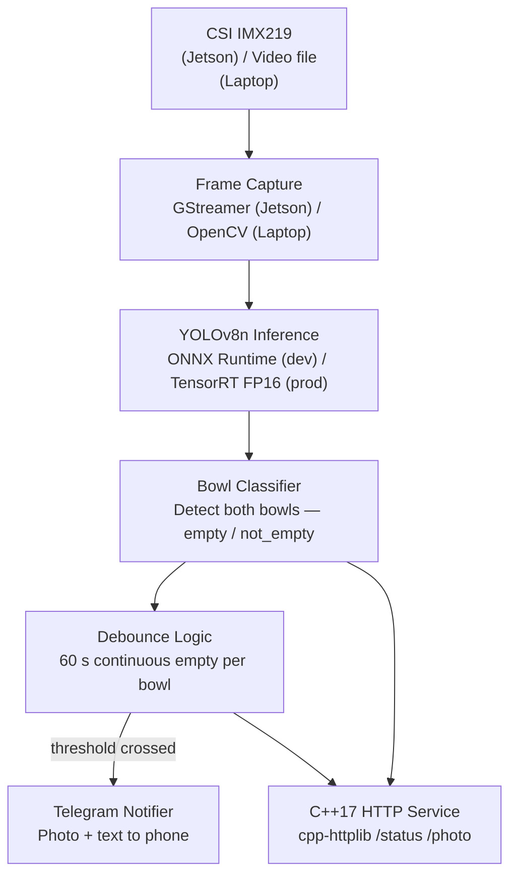

# CatBowlWatch

**Edge ML pipeline — Jetson Nano 4GB + CSI camera → YOLOv8n → C++17 service → Telegram alert.**

Two cat food bowls. One camera. Fully automatic detection, no manual ROI. When either bowl has been empty for ≥ 60 consecutive seconds the system sends a Telegram photo + text notification to your phone.

Built as a portfolio piece demonstrating end-to-end ML-to-C++ edge deployment: data collection, training, ONNX inference, debounce logic, real-time notification, and hardware deployment on Jetson Nano — all from scratch.

---

## Demo (~20-second quick-start)

```bash
# Requires Docker and a valid .env with TELEGRAM_BOT_TOKEN + TELEGRAM_CHAT_ID
git clone https://github.com/YOUR_HANDLE/catbowlwatch
cd catbowlwatch
cp demo/.env.example .env     # fill in your Telegram credentials
docker compose -f docker/demo.yml up
```

The demo loops `data/videos/sample_video.mp4` (empty bowl visible from frame 1), runs inference with `DEBOUNCE_SECONDS=8`, and fires a real Telegram photo notification. **Notification arrives ~15 seconds after the service starts.** No Jetson needed.

> Production deployments use the 60 s debounce default. The demo override is explicit — see `demo/.env.example`.

---

## Architecture Overview



---

## Tech Stack

| Layer | Laptop (Dev) | Jetson (Prod) |
|---|---|---|
| Capture | OpenCV `VideoCapture` | GStreamer + `nvarguscamerasrc` |
| Model | YOLOv8n `.onnx` | YOLOv8n `.engine` (TensorRT FP16) |
| Runtime | ONNX Runtime CPU | TensorRT 8.x |
| Service | C++17 + cpp-httplib | Same binary, systemd unit |
| Notification | Telegram Bot API | Same |
| Low-light | Brightness sim (software) | IR floodlight + GPIO trigger |
| OS | macOS / Ubuntu 22.04 | JetPack TBD (B01 → 4.6.4; Orin Nano → 6.x) |

---

## Project Structure

```
catbowlwatch/
├── data/                  # Images, YOLO labels, sample_video.mp4
│   ├── images/
│   ├── labels/
│   └── videos/
├── training/              # dataset.py, train.py, augmentations, export.py
├── inference/             # C++17 ONNX/TensorRT inference service
├── notification/          # Telegram notifier module
├── deployment/            # GStreamer pipeline, systemd, GPIO, deploy.sh
├── demo/                  # docker-compose demo, quick-start assets
├── models/                # .pt  .onnx  .engine artifacts
├── scripts/               # collect_data.py, train.sh, build.sh
├── docker/                # Training + demo Dockerfiles
├── tests/                 # Parity + unit tests
├── docs/                  # All design and architecture documentation
├── .github/workflows/     # CI (lint, test, ONNX export validation)
├── README.md
└── LICENSE
```

---

## Development Phases

| # | Phase | Runs on | Status |
|---|---|---|---|
| 1 | Data Collection | Laptop | **In Progress** |
| 2 | Training Pipeline | Laptop / Colab | Planned |
| 3 | Inference Service (ONNX) | Laptop | Planned |
| 4 | Notification | Laptop | Planned |
| 5 | Hardware Deployment & TensorRT Swap | Jetson Nano | Pending hardware |

---

## Prerequisites

- Python ≥ 3.10, PyTorch ≥ 2.1, Ultralytics ≥ 8.1
- CMake ≥ 3.22, GCC ≥ 11 (C++17)
- ONNX Runtime ≥ 1.17 (CPU build for laptop)
- Docker ≥ 24 (for demo and training containers)
- A Telegram bot token — see [docs/DESIGN_REQUIREMENTS.md](docs/DESIGN_REQUIREMENTS.md)

---

## Documentation

| Doc | Contents |
|---|---|
| [docs/DESIGN_REQUIREMENTS.md](docs/DESIGN_REQUIREMENTS.md) | Functional + non-functional requirements, Telegram setup, constraint rationale |
| [docs/ARCHITECTURE.md](docs/ARCHITECTURE.md) | Full system architecture, data flow, component contracts, swap plan |

---

## License

MIT — see [LICENSE](LICENSE).
