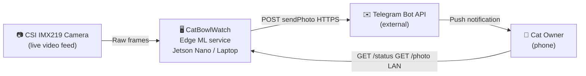
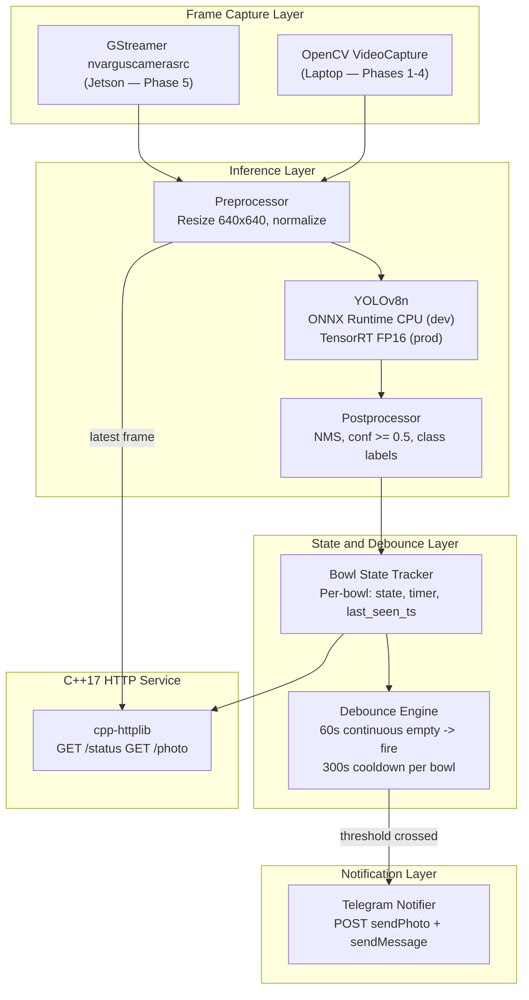
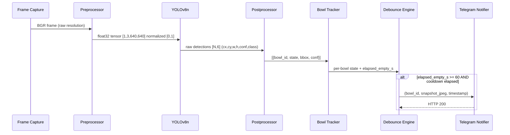
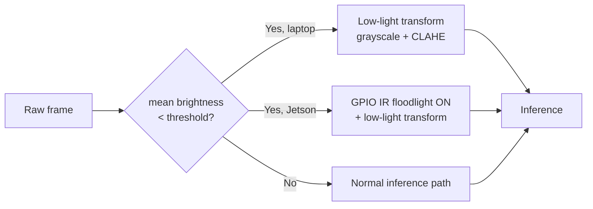

# CatBowlWatch — Architecture

> **Status:** Phase 1b in progress (pipeline dry-run validated, awaiting real labelled images). Phase 2 scaffolds landed early in parallel: `training/augmentations.py`, `training/train.py`, `training/export.py` (with ONNX shape verification against the `[1, 6, 8400]` contract). End-to-end Phase 2 still gated on real data + `poetry install --with training`.
> **Last updated:** 2026-05-19

---

## 1. System Context

All inference, debounce logic, and notification run on a single device. No cloud component except the Telegram Bot API (outbound only).



---

## 2. Component Architecture



---

## 3. Data Flow — Single Frame



---

## 4. Component Contracts

### 4.1 Frame Capture
- **Output:** Raw BGR `cv::Mat`, variable resolution.
- **Contract:** Loop on end-of-file (video mode). Consistent frame rate.
- **Swap point:** Replace `cv::VideoCapture` with GStreamer pipeline string at Phase 5. Interface is unchanged — single `read(frame)` call.

### 4.2 Preprocessor
- **Output:** `float32` tensor `[1, 3, 640, 640]`, RGB channel order, pixel values in `[0, 1]`.
- If mean frame brightness < `BRIGHTNESS_THRESHOLD` (default: 50/255): apply IR simulation transform (grayscale → 3-channel, contrast stretch).
- On Jetson: low-light condition also triggers GPIO IR floodlight.

### 4.3 YOLOv8n Inference
- **Output:** Raw ONNX output `[1, 6, 8400]` (640×640 input, 2 classes). The first dimension is batch, the second is `4 bbox + num_classes`, the third is the number of anchors.
  - Postprocessor **must** transpose to `[8400, 6]` before iterating.
  - Columns after transpose: `[cx, cy, w, h, bowl_empty_score, bowl_not_empty_score]`.
  - There is **no single "confidence" column** — compute: `confidence = max(col[4], col[5])`, `class_id = argmax(col[4], col[5])`.
  - Verify actual shape before writing C++ postprocessor: `python -c "import onnxruntime as ort, numpy as np; s=ort.InferenceSession('models/catbowlwatch.onnx'); print(s.run(None,{s.get_inputs()[0].name:np.zeros((1,3,640,640),dtype='f4')})[0].shape)"`
- **Backend contract:** Abstract `InferenceBackend` interface with two concrete implementations:
  - `OnnxBackend` — wraps ONNX Runtime session (laptop, CPU).
  - `TrtBackend` — wraps TensorRT execution context (Jetson, FP16).
- Swap via config flag: `INFERENCE_BACKEND=onnx|tensorrt`. No C++ code change required.

### 4.4 Postprocessor
- NMS: IoU threshold 0.45, confidence threshold 0.50 (both configurable).
- Class map: `bowl_empty=0`, `bowl_not_empty=1`.
- Bowl identity assigned by x-coordinate: left bowl = `bowl_1`, right bowl = `bowl_2`. Deterministic for a fixed overhead camera.

### 4.5 Bowl State Tracker

```cpp
struct BowlState {
    std::string bowl_id;          // "bowl_1" | "bowl_2"
    std::string state;            // "empty" | "not_empty" | "undetected"
    float       confidence;
    int64_t     empty_since_ms;   // epoch ms when bowl became empty; -1 if not empty
    cv::Rect2f  bbox;
};
```

- If a bowl is not detected in a frame, state is held for up to `DETECTION_HOLD_FRAMES` (default: 5) frames before being marked `undetected`.
- **Bowl registration warm-up:** Both bowls must be detected simultaneously in ≥ 3 of the first 30 processed frames before debounce timers are armed. Until registered, `/status` reports `"registration_pending": true` and no alerts fire. This prevents startup race conditions where a single detection is assigned the wrong bowl identity via the x-coordinate heuristic.

### 4.6 Debounce Engine

```
Per bowl:
  if state == "empty"
     AND (now_ms - empty_since_ms) >= 60000
     AND (now_ms - last_alert_ms)  >= 300000:
       fire alert
       last_alert_ms = now_ms
```

All state is in-memory. Timers reset on service restart — acceptable for MVP.

### 4.7 HTTP Service (`/status`, `/photo`)

```
GET /status  →  200 OK  application/json
{
  "bowls": [
    {"id": "bowl_1", "state": "empty",     "empty_for_s": 42, "confidence": 0.87},
    {"id": "bowl_2", "state": "not_empty", "empty_for_s": 0,  "confidence": 0.93}
  ],
  "registration_pending": false,
  "fps": 14.2,
  "uptime_s": 3820
}

GET /photo  →  200 OK  image/jpeg  (latest annotated frame)
```

- **Threading:** `cpp-httplib` runs in thread-pool mode (`Server::new_task_queue`, pool size 4). The HTTP server thread and the inference loop share `latest_frame` via a `std::mutex`-protected `cv::Mat`. `GET /photo` acquires the lock, clones the frame, releases the lock immediately, then JPEG-encodes outside the lock. This prevents inference stalls on slow HTTP clients.

### 4.8 Telegram Notifier
- Sends `POST /sendPhoto` (multipart/form-data) with JPEG + caption.
- Retries up to 3× with 2 s backoff on network error.
- Runs in a dedicated thread — does not block the inference loop.

---

## 5. Backend Swap Plan (ONNX → TensorRT)

| Step | Action | Where |
|---|---|---|
| 1 | Export trained `.pt` to TensorRT `.engine` on Jetson | `scripts/export_trt.sh` |
| 2 | Set `INFERENCE_BACKEND=tensorrt` | `deployment/catbowlwatch.service` env block |
| 3 | Set `MODEL_PATH=/models/catbowlwatch.engine` | same |
| 4 | `systemctl restart catbowlwatch` | Jetson |

No C++ code changes at swap time.

**Conditional compilation:** `TrtBackend` requires TensorRT headers (`NvInfer.h`) which are not available on macOS or Ubuntu without a GPU. The CMakeLists.txt must gate it behind an option:

```cmake
option(WITH_TENSORRT "Build TensorRT backend (requires NvInfer.h)" OFF)
```

```cpp
// inference/TrtBackend.h
#pragma once
#ifdef WITH_TENSORRT
#include <NvInfer.h>
// ... implementation
#endif // WITH_TENSORRT
```

Laptop builds: `cmake -DWITH_TENSORRT=OFF ..` (default).
Jetson builds: `cmake -DWITH_TENSORRT=ON ..`.

---

## 6. Low-Light Adaptive Preprocessing



The brightness threshold and low-light transform parameters are matched to the training-time augmentation pipeline so inference and training see the same distribution.

**Note on terminology:** This is a brightness-triggered single-channel preprocessing transform, not sensor fusion. "Fusion" implies combining information from multiple independent sensors. Use the term "low-light adaptive preprocessing" when describing this feature.

---

## 7. Directory–Component Mapping

| Directory | Component(s) |
|---|---|
| `training/` | dataset.py ✓, augmentations.py ✓ (low-light), train.py ✓, export.py ✓ |
| `inference/` | ☐ Capture, Preprocessor, OnnxBackend, TrtBackend, Postprocessor, BowlTracker, DebounceEngine, HTTP server |
| `notification/` | ☐ Telegram notifier |
| `deployment/` | ☐ GStreamer config, systemd unit, GPIO IR trigger, deploy.sh |
| `demo/` | .env.example ✓; docker-compose.yml ☐ |
| `models/` | ⏳ .pt, .onnx, .engine (gitignored) |
| `scripts/` | collect_data.py ✓, organise_raw.py ✓, validate_labels.py ✓, split_dataset.py ✓, _generate_synthetic.py ✓ (dev aid); Phase 5: build.sh ☐, export_trt.sh ☐ |
| `docker/` | ☐ Dockerfile.training, Dockerfile.demo |
| `tests/` | ✓ organise / validate / split / BowlDataset / augmentations / train / export; ☐ Phase 2 ONNX/TRT parity (needs a real `.onnx`), Phase 3 debounce unit tests |
| `docs/` | DESIGN_REQUIREMENTS.md ✓, ARCHITECTURE.md ✓ |

---

## 8. Key Architectural Decisions

| Decision | Chosen | Alternative | Rationale |
|---|---|---|---|
| Single YOLOv8n for detect+classify | Yes | Separate detector + classifier | One inference pass, simpler TRT export, fewer moving parts |
| Bowl identity by x-coordinate | Yes | SORT/DeepSORT tracker | Camera is fixed overhead; x-ordering is stable and deterministic |
| Debounce state in-memory | Yes | Redis / SQLite | Zero deps on Jetson; restart resets timers — acceptable for MVP |
| C++17 inference service | Yes | Python FastAPI | Portfolio goal; no GIL; clean TRT integration |
| ONNX on laptop / TRT on Jetson | Yes | TRT everywhere | TRT requires CUDA; laptop-first constraint demands ONNX for dev |
| cpp-httplib | Yes | Crow / Pistache | Header-only, zero external deps, two endpoints is all we need |
| Telegram | Yes | SMTP / Pushover | Free, phone-native push, photo attachment in one API call |

---

## 9. Future Extension Points (post-MVP, do not implement now)

- **Multi-camera:** Abstract capture layer; instantiate N capture + inference threads.
- **Historical data:** SQLite event log in debounce engine; expose `GET /history`.
- **Cat ID:** Second classification head or lightweight re-ID model.
- **Web dashboard:** WebSocket stream + minimal React frontend.
